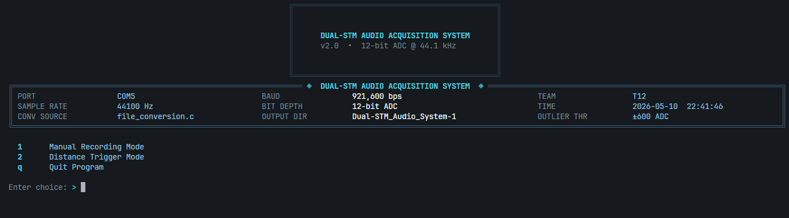
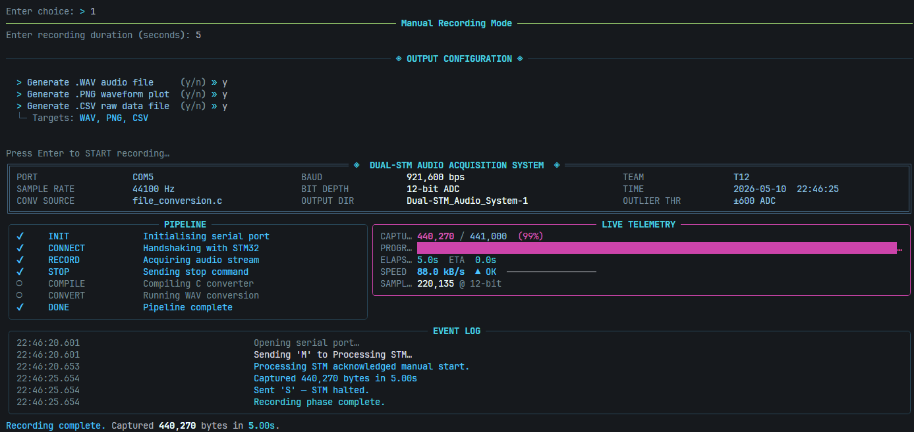
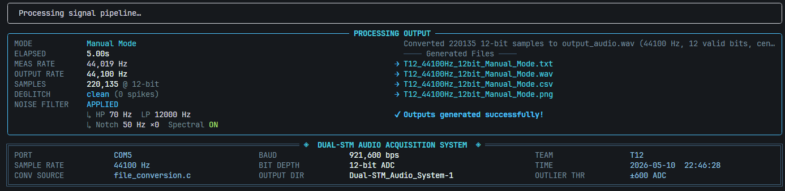
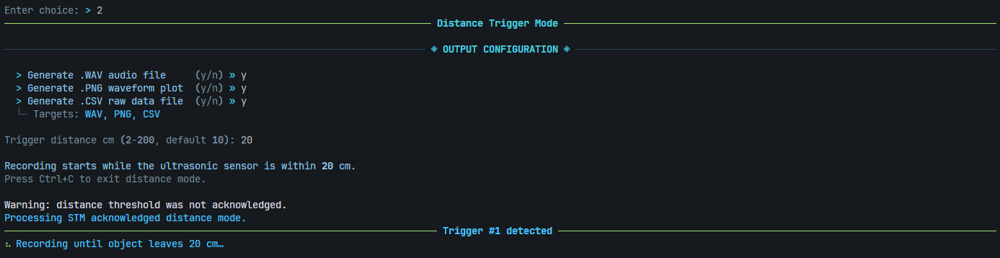
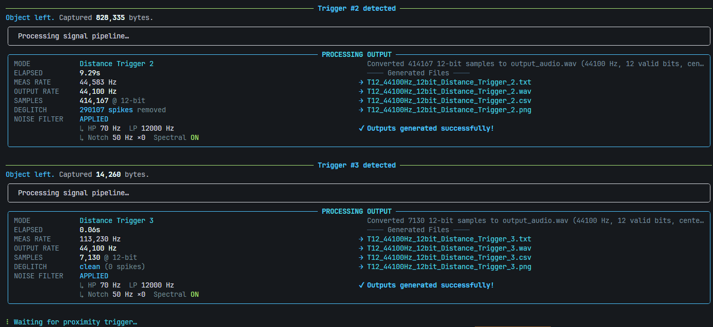
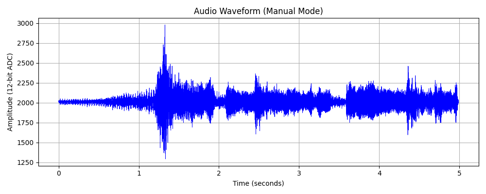
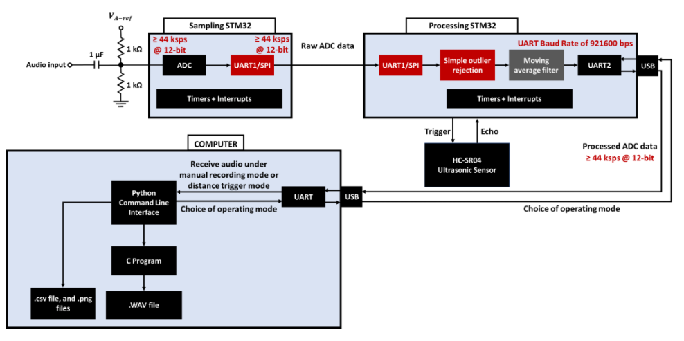
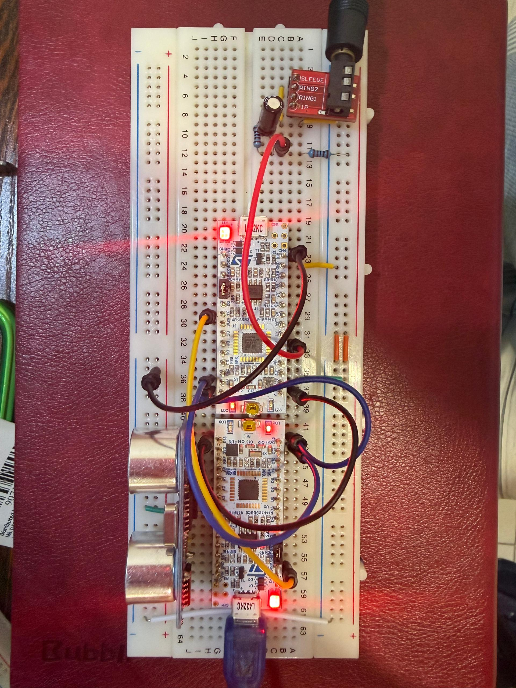

<div align="center">

# Dual-STM Audio System
### Realtime 44.1 ksps / 12-bit Audio Acquisition, Processing, and Visualization Pipeline


[Project Specification](Docs/raw/ECE2071%20S1%202026%20-%20Project%20Specification%20%28Malaysia%20Campus%29.pdf) - [Sampling Firmware](01_Sampling_Data_Acquisition) - [Processing Firmware](02_Signal_Processing_Sensors) - [Python CLI](04_Python_CLI_Visualization) - [License](LICENSE)

</div>

---

## About

**Dual-STM Audio System** is the final ECE2071 project implementation for a two-microcontroller audio acquisition, processing, and visualization pipeline.

The system captures analog audio on a dedicated **Sampling STM32**, streams the samples to a **Processing STM32**, applies real-time filtering and sensor-controlled recording logic, and forwards the processed audio to a PC application for saving, conversion, and visualization.



The final version targets the highest project requirement:

```text
44.1 ksps sampling
12-bit audio samples throughout
SPI between STM32 boards
DMA for high-rate data movement
921600 bps UART from Processing STM32 to PC
```

Earlier intermediate requirements, such as the Task 3 `22 ksps / 8-bit` PC stream, are not kept as active modes because the final design supersedes them with the Task 4 `44.1 ksps / 12-bit` pipeline.

---

## Table of Contents

- [Key Features](#key-features)
- [Screenshots](#screenshots)
- [System Architecture](#system-architecture)
- [Project Structure](#project-structure)
- [Hardware and Software Requirements](#hardware-and-software-requirements)
- [Setup and Usage](#setup-and-usage)
- [User Guide](#user-guide)
- [Tech Stack](#tech-stack)
- [Project Specification Coverage](#project-specification-coverage)
- [Verification Checklist](#verification-checklist)
- [Contributors](#contributors)
- [License](#license)
- [Disclaimer](#disclaimer)

---

## Key Features

### Realtime Dual-STM Audio Pipeline

- **Sampling STM32:** captures analog audio using `ADC1` at 12-bit resolution.
- **Timer-triggered sampling:** uses `TIM6 TRGO` to keep the audio sampling interval stable.
- **ADC DMA:** stores samples into a circular buffer without CPU polling.
- **SPI DMA:** streams sample blocks from the Sampling STM32 to the Processing STM32.
- **Processing STM32:** receives SPI samples through DMA, filters them, and forwards them to the PC using UART DMA.

### Audio Quality and Processing

- **12-bit throughout:** ADC, SPI transfer, Processing STM filtering, UART output, Python decoding, and WAV metadata preserve 12-bit audio data.
- **3-sample moving average:** satisfies the Processing STM32 filtering requirement while keeping latency low enough for realtime streaming.
- **Outlier rejection:** suppresses spike samples before averaging, improving robustness when the analog input or inter-board stream contains abnormal jumps.
- **PC-side cleanup:** optional deglitching, high-pass, low-pass, spectral denoise, soft noise gate, clarity EQ, and edge fade improve saved output quality.

### Recording Modes

- **Manual Recording Mode:** the user chooses the recording duration from the Python CLI.
- **Distance Trigger Mode:** an HC-SR04 ultrasonic sensor starts and stops capture automatically.
- **Configurable trigger distance:** the user selects the distance threshold from the Python CLI before entering Distance Trigger Mode.
- **Debounced trigger logic:** repeated in-range and out-of-range readings are required before capture state changes, reducing false triggers.

### Output Generation

- **TXT:** readable 12-bit amplitude samples.
- **CSV:** processed samples with the sample rate stored in the first row.
- **PNG:** labelled amplitude-vs-time waveform plot.
- **WAV:** generated by compiling and running the C converter from Python.

Output filenames include the team ID, sample rate, bit depth, and recording mode:

```text
T12_44100Hz_12bit_Manual_Mode.wav
T12_44100Hz_12bit_Distance_Trigger.wav
```

---

## Screenshots

### Manual Recording Mode

| Duration Selection | Output Generation |
|---|---|
|  |  |

### Distance Trigger Mode

| Trigger Configuration | Trigger Capture |
|---|---|
|  |  |

### Generated Waveform Output



---

## System Architecture



```text
Analog Audio Input
  -> Sampling STM32
       ADC1, 12-bit
       TIM6 trigger at about 44.1 ksps
       ADC DMA circular buffer
       SPI1 master TX DMA

  -> Processing STM32
       SPI1 slave RX DMA
       12-bit sample masking
       outlier rejection
       3-sample moving average
       HC-SR04 distance trigger control
       USART2 TX DMA at 921600 bps

  -> PC Python CLI
       pyserial capture
       configurable operating modes
       optional PC-side filtering
       TXT / CSV / PNG output
       C converter compilation and WAV output
```

Command path:

```text
Python CLI
  -> USART2 command to Processing STM32
  -> USART1 command forwarded to Sampling STM32
```

Distance threshold configuration:

```text
Python sends:      R + one-byte distance_cm
Processing replies ACK:R:<distance_cm>
Python sends:      D
Processing replies ACK:D
```

---

## Project Structure

```text
Dual-STM_Audio_System/
|-- 01_Sampling_Data_Acquisition/
|   |-- README.md
|   `-- STM_Sampling/
|       |-- Core/
|       |-- Drivers/
|       `-- Project_Week_6.ioc
|
|-- 02_Signal_Processing_Sensors/
|   |-- README.md
|   `-- STM_Processing/
|       |-- Core/
|       |-- Drivers/
|       `-- STM_Processing.ioc
|
|-- 03_PC_File_Conversion/
|   |-- README.md
|   `-- file_conversion.c
|
|-- 04_Python_CLI_Visualization/
|   |-- README.md
|   |-- main_cli.py
|   `-- UI.py
|
|-- Docs/
|   |-- images/
|   |   |-- Distance_1.png
|   |   |-- Distance_2.png
|   |   |-- Manual_1.png
|   |   |-- Manual_2.png
|   |   |-- SystemArchitecture.png
|   |   |-- WAV_1.png
|   |   |-- image.png
|   |   `-- wiring.png
|   `-- raw/
|       `-- project specifications and weekly activity PDFs
|
|-- Milestone/
|   `-- Week 6 milestone reference implementation
|
|-- LICENSE
|-- SCHEMA.md
`-- README.md
```

Each subfolder has its own README with detailed requirement-by-requirement justification and code-level implementation notes.

---

## Hardware and Software Requirements

### Hardware Setup



Required hardware:

- 2 STM32 boards used as:
  - Sampling STM32
  - Processing STM32
- Analog audio input circuit connected to the Sampling STM32 ADC pin.
- HC-SR04 ultrasonic sensor connected to the Processing STM32.
- SPI wiring between the two STM32 boards.
- UART connection from Processing STM32 to PC.

### Software

- STM32CubeIDE for building and flashing firmware.
- Python 3.10 or later.
- `gcc` available on the system path for WAV conversion.
- Python packages:

```powershell
pip install pyserial numpy matplotlib
```

Optional for the enhanced terminal UI:

```powershell
pip install rich
```

---

## Setup and Usage

### 1. Clone the Repository

```bash
git clone https://github.com/SvnYearss/Dual-STM_Audio_System.git
cd Dual-STM_Audio_System
```

### 2. Build and Flash the Sampling STM32

1. Open `01_Sampling_Data_Acquisition/STM_Sampling` in STM32CubeIDE.
2. Build the project.
3. Flash it to the Sampling STM32.

The Sampling STM32 waits for start and stop commands forwarded by the Processing STM32.

### 3. Build and Flash the Processing STM32

1. Open `02_Signal_Processing_Sensors/STM_Processing` in STM32CubeIDE.
2. Build the project.
3. Flash it to the Processing STM32.

The Processing STM32 receives SPI audio, performs filtering, handles HC-SR04 trigger logic, and streams output to the PC.

### 4. Configure the Python Serial Port

The default PC serial configuration is in `04_Python_CLI_Visualization/main_cli.py`:

```python
PORT = "COM5"
BAUD = 921600
```

Update `PORT` if your Processing STM32 appears on a different COM port.

### 5. Run the Standard CLI

```powershell
python 04_Python_CLI_Visualization/main_cli.py
```

Menu options:

```text
1: Manual Recording Mode
2: Distance Trigger Mode
q: Quit Program
```

### 6. Run the Enhanced Rich UI

```powershell
python 04_Python_CLI_Visualization/UI.py
```

If `rich` is not installed, use the standard CLI or install the optional dependency.

---

## User Guide

### Manual Recording Mode

1. Select `1` from the CLI menu.
2. Enter the recording duration in seconds.
3. Choose whether to generate WAV, PNG, and CSV outputs.
4. Press Enter to start recording.
5. The CLI sends `M`, records for the selected duration, then sends `S`.
6. Output files are generated in the repository root.

### Distance Trigger Mode

1. Select `2` from the CLI menu.
2. Choose output formats.
3. Enter the ultrasonic trigger distance in centimeters.
   - Default: `10 cm`
   - Minimum: `2 cm`
   - Maximum: `200 cm`
4. The CLI configures the Processing STM32 with `R + distance_cm`.
5. The CLI enters Distance Trigger Mode with `D`.
6. Moving an object within the configured range starts recording.
7. Moving the object out of range stops recording.
8. The CLI continues waiting for future trigger events until `Ctrl+C`.

---

## Tech Stack

| Layer | Technology | Purpose |
|---|---|---|
| Sampling firmware | STM32 HAL C | ADC, timer trigger, DMA, SPI master streaming |
| Processing firmware | STM32 HAL C | SPI slave reception, filtering, HC-SR04 control, UART streaming |
| PC capture | Python + pyserial | Serial capture and command control |
| Visualization | Python + matplotlib | Labelled waveform PNG output |
| Data handling | Python + numpy | Sample cleaning, filtering, CSV/TXT preparation |
| WAV conversion | C | Binary-to-WAV conversion with explicit 12-bit metadata |
| Optional UI | Python Rich | More readable terminal workflow |

---

## Project Specification Coverage

| Project requirement | Final implementation and justification | Main implementation location |
|---|---|---|
| Task 1: MVP sample rate greater than 5 ksps | The final pipeline runs at about 44.1 ksps, so it exceeds the MVP sampling requirement by a large margin. | `01_Sampling_Data_Acquisition/STM_Sampling/Core/Src/main.c` |
| Task 1: at least 8-bit audio | The final design keeps 12-bit samples from ADC capture through PC output, which exceeds the 8-bit minimum. | Sampling firmware, Processing firmware, Python CLI, and C converter |
| Task 1: moving average filter on Processing STM32 | A 3-sample moving average is applied after outlier rejection to smooth the signal with minimal realtime latency. | `02_Signal_Processing_Sensors/STM_Processing/Core/Src/main.c` |
| Task 1: Python serial capture and file saving | Python opens the Processing STM32 serial port, records incoming bytes, decodes 12-bit samples, and writes TXT/CSV/PNG/WAV outputs. | `04_Python_CLI_Visualization/main_cli.py` |
| Task 1: Python compiles and runs C converter | Python calls the system C compiler and runs the generated converter so WAV output is produced by the C program. | `04_Python_CLI_Visualization/main_cli.py`, `03_PC_File_Conversion/file_conversion.c` |
| Task 2: Manual Recording Mode | The CLI sends `M` to start recording and `S` to stop after the selected duration. | `04_Python_CLI_Visualization/main_cli.py` |
| Task 2: Distance Trigger Mode | The CLI sends `D`; the Processing STM32 uses HC-SR04 distance readings to start and stop capture. | `02_Signal_Processing_Sensors/STM_Processing/Core/Src/main.c`, `04_Python_CLI_Visualization/main_cli.py` |
| Task 2: configurable trigger range | The CLI sends `R + distance_cm`; the Processing STM32 clamps and stores the threshold, then acknowledges with `ACK:R:<cm>`. | Processing firmware and Python CLI |
| Task 2: WAV, PNG, and CSV outputs | The final PC tool can generate WAV audio, labelled PNG waveform plots, and CSV sample data from the same recording. | `04_Python_CLI_Visualization/main_cli.py`, `03_PC_File_Conversion/file_conversion.c` |
| Task 2: CSV sample-rate metadata | The CSV output records the sample rate in the first row so downstream tools can interpret timing correctly. | `04_Python_CLI_Visualization/main_cli.py` |
| Task 2: labelled PNG waveform | The PNG waveform includes a title, time axis, amplitude axis, and grid for readable reporting. | `04_Python_CLI_Visualization/main_cli.py` |
| Task 3: outlier rejection | Abnormally large sample jumps are replaced before averaging, reducing the effect of spikes in the audio stream. | `02_Signal_Processing_Sensors/STM_Processing/Core/Src/main.c` |
| Task 3: intermediate 22 ksps / 8-bit stream | This requirement is superseded by the final Task 4 design, which keeps a higher 44.1 ksps / 12-bit stream instead of retaining a lower-quality mode. | Whole final pipeline |
| Task 4: 44 ksps throughout | Sampling, Processing STM32 forwarding, Python decoding, filenames, CSV metadata, waveform timing, and WAV metadata all target 44.1 ksps. | Sampling firmware, Processing firmware, Python CLI, and C converter |
| Task 4: 12-bit throughout | Samples are masked, stored, streamed, decoded, and written as 12-bit valid data rather than being reduced to 8-bit. | Sampling firmware, Processing firmware, Python CLI, and C converter |
| Task 4: baud rate no higher than 921600 | Processing STM32 UART and Python serial capture both use 921600 bps. | `02_Signal_Processing_Sensors/STM_Processing/Core/Src/main.c`, `04_Python_CLI_Visualization/main_cli.py` |

For deeper explanations of why each technology was used and how each feature is implemented, see:

- [Sampling README](01_Sampling_Data_Acquisition/README.md)
- [Processing README](02_Signal_Processing_Sensors/README.md)
- [C Converter README](03_PC_File_Conversion/README.md)
- [Python CLI README](04_Python_CLI_Visualization/README.md)

---

## Verification Checklist

Use this checklist before demonstration:

- Build and flash both STM32 projects.
- Confirm Python serial port matches the actual PC COM port.
- Run Manual Recording Mode and generate TXT, WAV, CSV, and PNG.
- Confirm WAV playback is recognisable.
- Confirm output filenames include `T12`, `44100Hz`, and `12bit`.
- Confirm CSV first row contains the sample rate.
- Confirm PNG has title and axis labels.
- Run Distance Trigger Mode with at least two different distance thresholds.
- Confirm the CLI receives `ACK:R:<cm>` and `ACK:D`.
- Confirm object movement starts and stops capture automatically.
- Use a logic analyzer or oscilloscope to verify the 44.1 ksps timing and SPI stream if hardware evidence is required.

---

## License

Distributed under the MIT License. See [LICENSE](LICENSE) for more information.

---

## Notes

- This is an academic engineering project for ECE2071.
- The final implementation is optimized for the Task 4 specification, so some earlier intermediate modes are intentionally not retained.
- Generated output files such as `.wav`, `.csv`, root-level `.png`, `.txt`, `.bin`, `.exe`, `Debug/`, and `__pycache__/` are ignored by Git.
- Curated README images in `Docs/images/` are kept in the repository so the GitHub README renders correctly.
- Hardware timing and audio quality should be validated on the physical setup before final demonstration.

---

## Disclaimer

This repository is an academic project and is not an official STMicroelectronics product. STM32, Monash University, and related trademarks belong to their respective owners.
